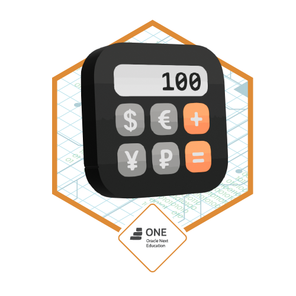

# Conversor de Monedas

Este proyecto es una aplicación Java que permite convertir montos entre diferentes monedas utilizando las tasas de cambio proporcionadas por la API [ExchangeRate-API](https://www.exchangerate-api.com/).

## Estructura del Proyecto

```
src/
└── com/
    └── conversormonedas/
        ├── modelo/
        │   ├── ExchangeRateResponse.java
        │   └── TasasConversion.java
        ├── servicio/
        │   ├── ServicioMoneda.java
        │   └── ServicioMonedaImpl.java
        ├── util/
        │   └── Constantes.java
        └── principal/
            └── Principal.java
```

### Descripción de Paquetes y Clases

- **`com.conversormonedas.util.Constantes`**
  Contiene constantes globales, como la URL de la API utilizada para obtener las tasas de cambio. La clave de API se lee desde la variable de entorno `EXCHANGE_API_KEY` (obligatorio).

- **`com.conversormonedas.modelo.ExchangeRateResponse`**
  DTO que mapea la respuesta JSON de la API usando Gson.

- **`com.conversormonedas.modelo.TasasConversion`**
  Representa las tasas de conversión obtenidas de la API. Proporciona métodos para recuperar la tasa de una moneda específica.

- **`com.conversormonedas.servicio.ServicioMoneda`**
  Interfaz que define los métodos para obtener las tasas de cambio y realizar conversiones de moneda.

- **`com.conversormonedas.servicio.ServicioMonedaImpl`**
  Implementación de la interfaz `ServicioMoneda`. Maneja la lógica para interactuar con la API y realizar conversiones.

- **`com.conversormonedas.principal.Principal`**
  Clase principal que interactúa con el usuario a través de la consola. Permite seleccionar monedas, ingresar montos y visualizar los resultados de la conversión.

## Funcionalidades

- Obtener tasas de cambio actualizadas desde la API de ExchangeRate.
- Realizar conversiones entre monedas seleccionadas.
- Monedas soportadas:
    - Dólar estadounidense (USD)
    - Peso argentino (ARS)
    - Real brasileño (BRL)
    - Peso colombiano (COP)

## Requisitos

- **Java 17** o superior.
- **Maven 3.6+** para compilar y ejecutar.
- Conexión a Internet (para consultar las tasas de cambio).

## Configuración de la API Key

**REQUERIDO.** Registrarse en [ExchangeRate-API](https://www.exchangerate-api.com/) para obtener una API key gratuita y configurarla como variable de entorno:

```bash
# En Windows (CMD)
set EXCHANGE_API_KEY=tu_clave_aqui

# En Windows (PowerShell)
$env:EXCHANGE_API_KEY="tu_clave_aqui"

# En Linux/macOS
export EXCHANGE_API_KEY=tu_clave_aqui
```

## Instrucciones de Uso

1. Clona el repositorio o descarga los archivos.
2. Asegúrate de tener configurado un entorno de desarrollo Java (JDK 17 o superior) y Maven.
3. Navega al directorio del proyecto y compila:
   ```bash
   mvn clean compile
   ```
4. Para ejecutar la aplicación:
   ```bash
   mvn exec:java -Dexec.mainClass="com.conversormonedas.principal.Principal"
   ```
   O empaquetar y ejecutar:
   ```bash
   mvn clean package
   java -jar target/conversormonedas.jar
   ```

## Ejemplo de Uso

****************************************
Sea bienvenido/a al Conversor de Moneda =]
****************************************
1) Dólar => Peso argentino
2) Peso argentino => Dólar
3) Dólar => Real brasileño
4) Real brasileño => Dólar
5) Dólar => Peso colombiano
6) Peso colombiano => Dólar
7) Salir
****************************************
Elija una opción válida: 1
Ingrese el monto a convertir: 100
Resultado: 100.00 USD = 28700.00 ARS

## Logro

Proyecto desarrollado como parte del programa **ONE - Oracle Next Education** (Alura Latam + Oracle).



## Créditos

Desarrollado por Hector Suarez.
Basado en la API de ExchangeRate-API.
